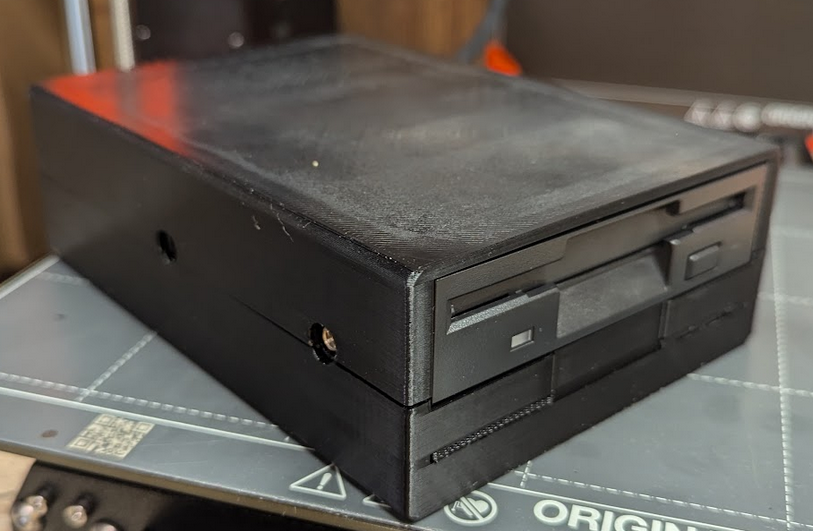
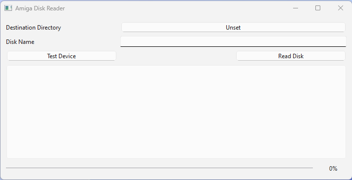
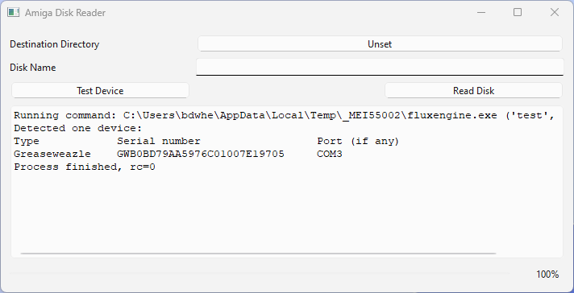
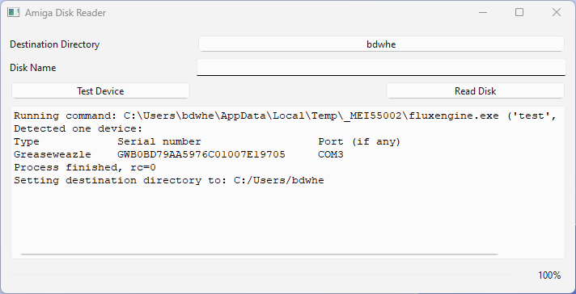
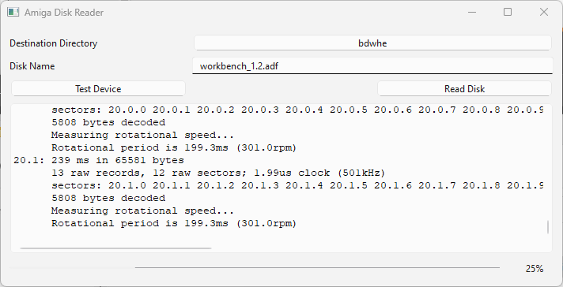

# floppy_disk_reader
Floppy disk reader w/case

# Physical Device

## Bill of Materials
|Qty| Description | Price |
|---|-------------|---|
| 1 | GreaseWeazle v4.1 (https://www.ebay.com/itm/255252124132) | $54.30 |
| 1 | 3.5" Floppy Drive (https://www.ebay.com/itm/156317606798) | $34.00 |
| 1 | Floppy Power Cable 4pk (https://www.amazon.com/dp/B0CLD7YRWC) | $7.88 |
| 1 | Floppy Data Cable 2pk (https://www.amazon.com/dp/B092VD1QQL) | $14.35 |
| 1 | USB-C Cable (https://www.amazon.com/dp/B01GGKZ2SC) | $6.99 |
|   | Total   | $117.52 |

### Not included
* I printed the case for a material cost of around $4 and approximately 
  4 hours of printing time.
* Screws, solder, heatshrink tubing, etc.  These were just laying around.

### Parts not used
* Only one of the data cables was used
* Two of the power cables were used


## Construction

### Case
Print the STL models in the case directory using these settings:
* PLA
* 0.40 nozzle
* 0.20 layer height
* 15% infill
* grid supports, everywhere
     
Using a Prusa MK4 with Input Shaper, each case half takes slighly more than 2 hours

### Power Cable Modification
The four power cables each have a standard molex connector on one end and a 3.5" floppy 
connector on the other.  The greaseweazle has a floppy power connector on it so the 
cable we need must have the same connector on both ends.

* On two of the cables, cut the cable around 1.5" from molex connector end.
* Solder like wires together (red <-> red, yellow <-> yellow, and 2 black <-> black) 
  using heatshrink tubing to avoid shorting.

### Assembly

* Remove the greaseweazle from the supplied case
* Transfer the greaseweazle to the bottom of the new case and attach it using the same 4 
  screws, aligning the USB C port with the hole in the back of the case.
* Connect the modified power cable to the greaseweazle and the floppy drive.
* Connect the data cable to the greaseweazle and the floppy drive, taking care to
align pin 1 on both devices.  In my case the twist end was near the greaseweazle.
* Remove the write enable jumper on the greaseweazle.
* Place the floppy drive into the top half of the case and use the two front screws to 
  secure them together.
* Fold the two halves of the case together, ensuring the cables do not get into a bind.
* Insert the rear screws through the case into the floppy drive .



# Using the Floppy Disk Reader

Plug the Greaseweazle-based disk drive into a USB port on your computer.

Download the floppy_disk_reader.exe file from .... onto your computer

When double-clicking on the icon, a window similar to this should appear:


The window contains various controls:
* The button labeled "Unset" is used to set the destination directory for the disk images
* The "Disk Name" field is used to name the next disk image that is read
* The Test Device button is used to verify the software is connected to the Greaseweazle
* The Read Disk is used to start reading a disk image.  This button is disabled until a 
  valid destination directory and disk name are selected.
* The large text area in the bottom displays the output of the disk reading commands
* The progress bar at the bottom indicates disk reading progress

## Testing Connectivity

Press the "Test Device" button to verify that the greaseweazle is connected and  
operating properly.

The main window should update with information about the connected device:


## Reading a disk image

Select a directory to hold the disk images.  
* Press the button next to the "Destination Directory" label, 
  which should be "Unset" when the program starts
* Use the file dialog to browse to the directory where you want the disk images 
  to be saved
* Press "Select Folder"
* The text on the button should be the name of the folder you have selected.  In 
  this case, the folder is named "bdwhe":


Set the name of the disk image to create
* Enter the name of the disk in the Disk Name field.  
* There are some restrictions to the disk name:  It can only contain the letters 
    `a`-`z`, `A`-`Z`, numbers `0`-`9`, or the special characters `.`, `-` and `_`.
* `.adf` will be added to the disk name if it is not present
* The "Read Disk" Button will be disabled until the destination folder is selected and 
    the disk name is valid

Read the disk
* Press the "Read Disk" button to start the process
* If the .adf file already exists, you will be asked if you want to overwrite it

The output area of the window will start displaying the output as the disk is read and 
the progress bar will display the progress:



When the read is complete the last few lines of the window will give the status of
the imaging process:
```
Good sectors: 1760/1760 (100%)
Missing sectors: 0/1760 (0%)
Bad sectors: 0/1760 (0%)
      IMG: wrote 80 tracks, 2 sides, 880 kB total to C:\Users\bdwhe\workbench_1.2.adf
Process finished, rc=0
**** DISK READ HAD ERRORS ****
Status codes and (track, side, sector)
--------------------
sector not found:
   (50, 1, 0)
```

In this case, track 50, side 1, sector 0 was unable to be read.  The disk may still be
usable if that particular sector didn't have data on it.  In the image itself, it will 
be stored as a sector of all zero bytes.

In the case of a good read the output window will display something similar to this:
```
Good sectors: 1760/1760 (100%)
Missing sectors: 0/1760 (0%)
Bad sectors: 0/1760 (0%)
      IMG: wrote 80 tracks, 2 sides, 880 kB total to C:\Users\bdwhe\workbench_1.2.adf
Process finished, rc=0
**** DISK READ SUCCESSFULLY ****
```

### Reading another disk
* You do not need to change the destination directory if your images are all going to be 
  stored in the same place
* Change the "Disk Name"
* Hit the "Read Disk" button
* Repeat as needed


## Exit the program
Hit the window close button to exit the program

## Troubleshooting

Sometimes the greaseweazle will get confused if the disks are changed while it is
reading or if a read is started with no disk in the drive.  It should be safe to unplug
the drive from the computer and restart the program


## Credits
The case was downloaded from https://www.printables.com/model/83539-greaseweazle-v41-v4-f1-plus-mini-case-with-space-f/files


The hardware is based on Greaseweazle.  More information can be found at: 
https://github.com/keirf/greaseweazle

This software uses FluxEngine to talk to the Greaseweazle.  More information can be found
at: https://github.com/davidgiven/fluxengine

